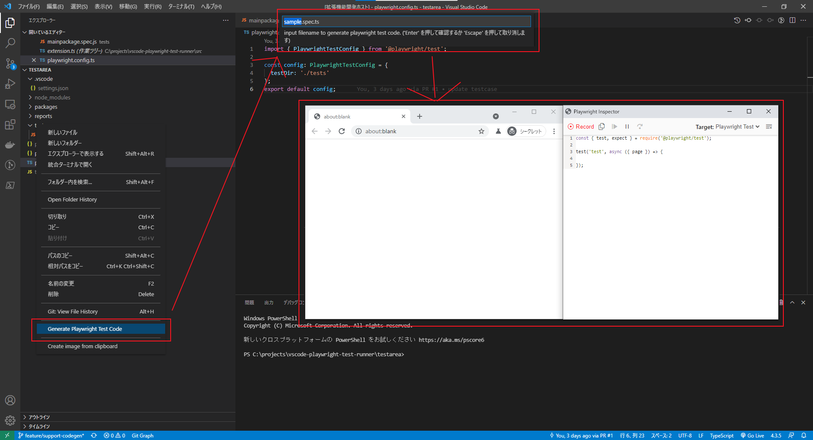

# Playwright Test Runner

Running or debugging a specific test or test-suite by playwright.

[VisualStudio Marketplace](https://marketplace.visualstudio.com/items?itemName=sakamoto66.vscode-playwright-test-runner)

## Features

Simple way to run or debug a specific test
*As it is possible in IntelliJ / Webstorm*

Run, Debug and Inspect your Playwright from

- Context-Menu
- CodeLens
- Command Palette [ strg(ctrl) + shift + p ]

## Supports

- Run playwright test
- Debug playwright test
- Inspect playwrigt test
- Show Playwright Test Report By json format
- Genrate Playwright Test Code


## Extension Settings

Playwright Test Runner will work out of the box, with a valid Jest config.
If you have a custom setup use the following options to configure Playwright Test Runner:

### Variable

sample : `/workspace/packages/sample/tests/test.spec.js`

| Variable | Description | sample |
| --- | --- | --- |
|`${workspaceRoot}`|the path of the project opened in vscode.| /workspace |
|`${packageRoot}`|the path of directory with package.json.| /workspace/packages/sample |
|`${currentFile}`|the current file | /workspace/packages/sample/tests/test.spec.js |
|`${fileBasename}`|the current file name with ext.| test.spec.js |
|`${fileBasenameNoExtension}`|the current file name without ext.| test.spec |
|`${fileExtname}`|the current file name with ext.| .js |
|`${fileDirname}`|the current file name with ext.| /workspace/packages/sample/tests |

### Extension Settings for playwright

| Command | Description |
| --- | --- |
| playwrightrunner.playwrightCommand | Define an alternative playwright command (e.g. `npx playwright`) |
| playwrightrunner.playwrightConfigPath | Playwright config path (relative to ${packageRoot} e.g. `playwright.config.ts`) |
| playwrightrunner.playwrightRunOptions | Add CLI Options to the playwright Command (e.g. `--headed`) <https://playwright.dev/docs/test-intro> |
| playwrightrunner.playwrightEnvironmentVariables | Add Environment Variables  (e.g. `NODE_ENV=product`) |

### Extension Settings for common

| Command | Description |
| --- | --- |
| playwrightrunner.disableCodeLens | Disable CodeLens feature |
| playwrightrunner.codeLensSelector | CodeLens will be shown on files matching this pattern (default **/*.{test,spec}.{js,jsx,ts,tsx}) |
| playwrightrunner.projectPath | Absolute path to project directory (e.g. /home/me/project/sub-folder) |
| playwrightrunner.changeDirectoryToWorkspaceRoot | Changes directory to workspace root before executing the test |

## Shortcuts

click File -> Preferences -> Keyboard Shortcuts -> "{}" (top right)
the json config file will open
add this:

```javascript
{
  "key": "alt+1",
  "command": "playwrightrunner.runTest"
},
{
  "key": "alt+2",
  "command": "playwrightrunner.debugTest"
},
{
  "key": "alt+3",
  "command": "playwrightrunner.inspectTest"
},
```

## Want to start contributing features?

[Some open topics get you started](https://github.com/sakamoto66/vscode-playwright-test-runner/issues)

## Show Playwright Test Report

You can check the reporter (json) output by Playwright.

- step 1  
create playwright.config

```javascript
module.exports = {
    reporter:[ ['list'], [ 'json', {  outputFile: 'reports.json' }] ]
}
```

- step 2  
Run playwright

- step 3  
show playwright test report


## Genearete Playwright Test Code

You can generate Playright test code.

- step 1  
select "Generate Playwright Test Code" from right menu on explorer.

- step 2  
please input filename to generate playwright test code.

- step 3  
open browser and inspect

- step 4  
close browser and genrate test code.


